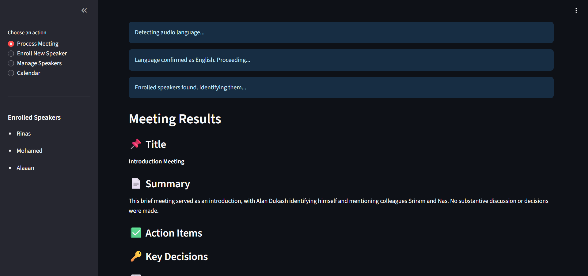
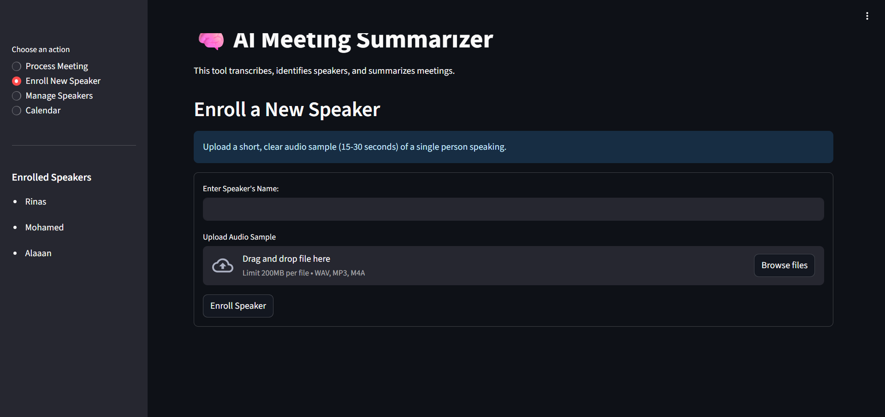
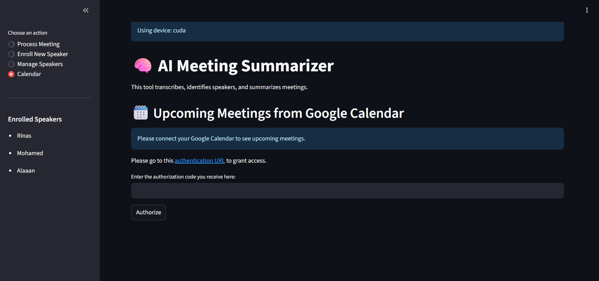
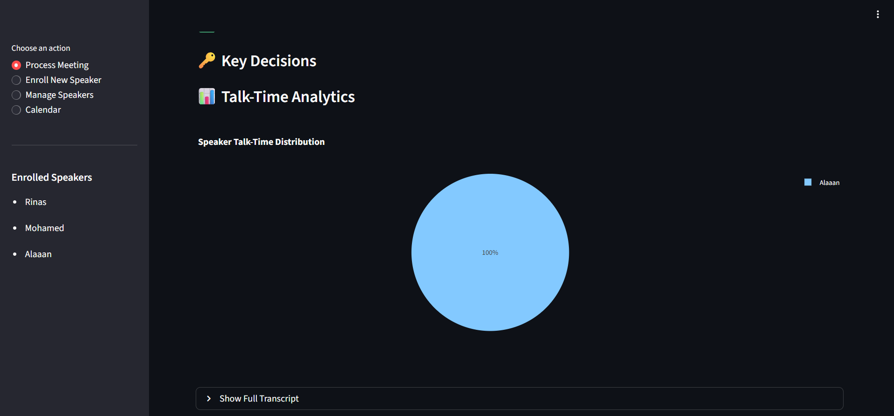
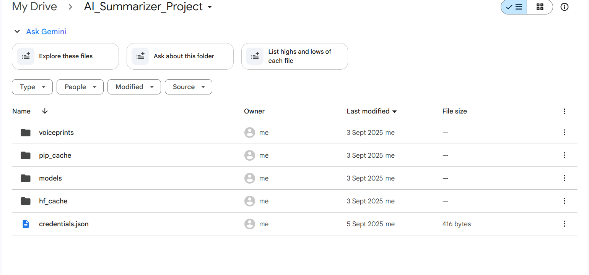

# Universal AI Meeting Summarizer

A powerful, multilingual AI assistant that automatically transcribes, identifies speakers, and generates intelligent summaries for meetings from any audio source. This prototype is a platform-agnostic solution, working with audio from Google Meet, Zoom, Microsoft Teams, and more.

Developed in Salem, India, this project showcases a complete, end-to-end AI workflow from raw audio to actionable business intelligence.

---

## ✨ Application Preview

The application features a clean, intuitive interface with a sidebar for easy navigation between different modes of operation.

| Meeting Results & Analytics | Speaker Enrollment | Calendar Integration |
| :---: | :---: | :---: |
|  |  |  |

---

## 🚀 Key Features

### **Intelligent Meeting Analysis**
The core of the application is its ability to process meeting audio and deliver structured insights. After analysis, it provides a comprehensive breakdown including a summary, action items, key decisions, and a full conversational transcript.

*The system automatically generates a talk-time distribution chart for clear analytics on participant contribution.*

### **Multilingual Transcription & Speaker Recognition**
* **High-Accuracy Transcription:** Powered by OpenAI's `medium` Whisper model for a great balance of speed and accuracy on a free GPU.
* **Multi-Language Support:** Full support for **English, Tamil, Hindi, Malayalam, and Kannada**. The system also includes a language detection feature to prevent mismatches.
* **Speaker Enrollment:** Users can enroll speakers by providing a short voice sample, allowing the AI to identify them by name in future meetings.

### **Calendar Integration**
The assistant can securely connect to a user's Google Calendar to display a dashboard of upcoming meetings, creating a single hub for their schedule.

---

## 🛠️ Getting Started: A Step-by-Step Guide

This project is designed to be run in a Google Colab environment. Follow these steps carefully to get it running.

### **Step 1: Prerequisites (One-Time Setup)**

Before running the notebook, you must complete the following setup:

1.  **Create Google Drive Folders:**
    * In your Google Drive, create a main folder named `AI_Summarizer_Project`.
    * Inside it, create four empty subfolders: `models`, `pip_cache`, `hf_cache`, and `voiceprints`.
    * Upload your `credentials.json` file (obtained from Google Cloud) into the main `AI_Summarizer_Project` folder.
    * 

2.  **Configure Google Cloud Project:**
    * Create a project in the [Google Cloud Console](https://console.cloud.google.com/).
    * Enable the **Google Calendar API**.
    * Configure the **OAuth Consent Screen** (as an "External" app) and add your email as a test user.
    * Create **OAuth 2.0 Credentials** for a **`Desktop app`**.
    * Download the JSON file and rename it to `credentials.json` before uploading it to Google Drive.

3.  **Get Your API Keys & Tokens:**
    * **Hugging Face Token:** Create a `read` token from [hf.co/settings/tokens](https://hf.co/settings/tokens). You must also accept the user conditions on the model pages for `pyannote/speaker-diarization-3.1`, `pyannote/segmentation-3.0`, and `pyannote/embedding`.
    * **Google Gemini API Key:** Get your key from [aistudio.google.com/app/apikey](https://aistudio.google.com/app/apikey).
    * **Ngrok Authtoken:** Get your token from your [ngrok Dashboard](https://dashboard.ngrok.com/get-started/your-authtoken).

### **Step 2: Launch the Application in Colab**

1.  **Open the Notebook:** Open the `AI_Summarizer_Project.ipynb` notebook in Google Colab.

2.  **Set Up Colab Secrets:** In the Colab sidebar (🔑 icon), add your three secrets with these exact names: `HF_TOKEN`, `GEMINI_API_KEY`, and `NGROK_AUTH_TOKEN`. Ensure the toggle next to each is enabled.

3.  **Enable GPU:** Go to **`Runtime > Change runtime type`** and select **`T4 GPU`** as the hardware accelerator.

4.  **Run the Cells in Order:**
    * **Run the Master Setup Cell:** Execute the first large code cell. This will install all dependencies and download the AI models to your Drive cache.
    * **Run the Application Cell:** Execute the second large code cell (the one starting with `%%writefile app.py`).
    * **Run the Launcher Cell:** Execute the final code cell.

5.  **Open the App:** A public `ngrok` URL will be printed. Click this link to open your AI Meeting Summarizer in a new browser tab and start using it!

---

## 📜 License

This project is licensed under the MIT License. See the `LICENSE` file for details.

---

 Contact

Mohamed Rilvan Rinas
Email: [rilvanrinas@gmail.com]
